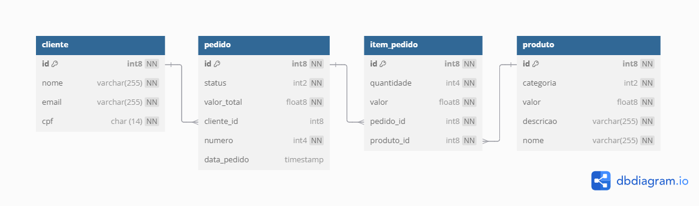

# 💡 Introdução

## Objetivo ##
Este repositório contém uma estrutura de arquivos `hcl` para o provisionamento de infraestrutura na AWS. Esta arquitetura é composta pelo RDS organizado em um módulo distinto para facilitar a manutenção e escalabilidade.

## 📦 Estrutura ##

- *rds:* Provisionamento do cluster RDS.

### Pré-requisitos

- *AWS CLI:* Configurado com um perfil para autenticação.
- *Terraform:* Certifique-se de que a versão instalada seja compatível com os provedores declarados (~> 4.0).

### Configuração Inicial

- *Configurar o AWS CLI:* Execute `aws configure` e configure o perfil de autenticação com as credenciais apropriadas para provisionar a infraestrutura na região `us-east-1` juntamente com uma *access_key* e uma *secret_key*.
- *Configurar o backend do Terraform:* A pasta `rds` possui um backend remoto cujo state é salvo em um Workspace do Terraform Cloud, por isso é necessário em execuções locais executar o [Terraform Login](https://developer.hashicorp.com/terraform/tutorials/cloud-get-started/cloud-login#start-the-login-flow).

### Como as Actons Funcionam?
- Para executar o Apply ou Destroy em sua infraestrutura basta selcionar o workspace `Terraform Apply/Destroy`em seguida clique em `run workflow`.
- As Actions utilizam um backend remoto da Hascorp para guardar o arquivo do State, para isso caso seja necessário gerenciar a infraestrutura por uma outra conta de AWS é necessário alterar dentro do Workflow criado no Terraform Cloud as vériaveis de ambiente *(AWS_ACCESS_KEY_ID e AWS_SECRET_ACCESS_KEY)* além do `HASHICORP_TOKEN` que será gerado em sua respectiva conta.

- Para integrar este backend com o terraform preciso declar esta estrutura no arquivo `providers.tf`:

```hcl
  backend "remote" {
    hostname     = "app.terraform.io"
    organization = "sua-org"

    workspaces {
      name = "seu-workspace"
    }
  }
```

- *hostname* = Sempre vai ser `app.terraform.io`
- *organization* = Aqui declaramos a organizarion em que estão inseridos os workspaces, caso necessário troque este valor para o sua organization criada posteriormente.
- *workspaces* = Aqui declaramos o nome do workspace, caso necessário troque este valor para o seu workspace criado posteriormente

## Como Provisionar Recursos ##

### Configurar o RDS

Acesse e execute os seguintes comandos na pasta `rds:`

```bash
terraform init
terraform apply

```

## 📦 Banco de dados

## Modelagem ##




## Justificativa ##

A escolha de um banco de dados relacional (SQL) para o projeto da lanchonete é ideal pelos seguintes motivos:

- **Estrutura Definida:** O modelo da lanchonete inclui entidades com relacionamentos bem estruturados, com atributos bem definidos, de modo que a flexibilidade do banco de dados passa a não ser prioridade. Sendo assim, o SQL permite modelar esses relacionamentos por meio de chaves estrangeiras e tabelas associativas, mantendo a integridade referencial entre as entidades, algo essencial em um sistema onde as operações precisam ser confiáveis e consistentes.

- **Integridade e Consistência:** Transações ACID e restrições como chaves primárias e estrangeiras asseguram que os dados sejam consistentes e confiáveis, mesmo em caso de falhas. Se um cliente faz um pedido e o sistema falha no meio da transação, o SQL reverte todas as operações já realizadas, mantendo a consistência dos dados e garantindo que um pedido não exista sem um cliente associado e um item só possa ser criado com seu pedido e produto.

- **Consultas Complexas:** É possível realizar consultas complexas utilizando comandos poderosos de JOIN, permitindo extrair dados de várias tabelas simultaneamente. Dessa forma, caso seja necessário obter todos os pedidos de um cliente, com seus respectivos produtos e quantidades, o SQL permite realizar essas consultas de maneira direta e eficiente. 

- **Escalabilidade:** Como o volume de dados necessário é moderado e a prioridade é a organização e relacionamento dos dados, então escalabilidade não é uma preocupação grande isso faz com que modelos NoSQL passem a não ser tão atraentes para ser utilizado na estrutura da lanchonete.

- **Conhecimentos do Time:** O time de desenvolvedores do projeto já possui conhecimentos prévios avançados na utilização de um banco de dados SQL, o que facilitaria sua modelagem e implementação perante outros tipos de bancos.